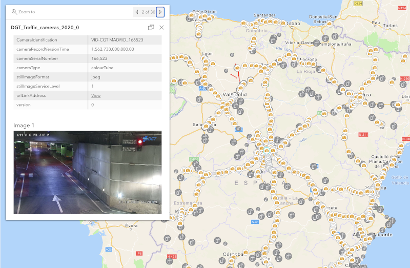

# koop-provider-dgt-datex

This is a [KoopJS provider](https://koopjs.github.io/docs/available-plugins/providers) to extract, transform and load cameras and radars from [the service](http://infocar.dgt.es/datex2/dgt/CCTVSiteTablePublication/all/content.xml) of the [General Direction of Traffic of Spain](http://www.dgt.es/es/) as an ArcGIS Feature Service.

**Demo**: [check sample map with the data](https://www.arcgis.com/apps/mapviewer/index.html?webmap=23faaa6b821946ea8b7257a6afc83e00)

[](https://www.arcgis.com/apps/mapviewer/index.html?webmap=23faaa6b821946ea8b7257a6afc83e00)

## Run standalone provider

Just clone this repository, install the dependecies and run `koop serve`

```
$ git clone git@github.com:esri-es/koop-provider-dgt-datex.git
$ npm install
$ koop serve
```

Then you are ready to go: `http://localhost:8080/koop-provider-dgt-datex/{entity}/rest/services/FeatureServer/0/query`

> {entity} can be: cameras, cabin_radars, segment_radars

You can test it using the following [FeatureLayer sample](https://codepen.io/hhkaos/pen/WNwVMpY?editors=1000):

[.](https://codepen.io/hhkaos/pen/WNwVMpY?editors=1000)

> **Note:** To be able to run it on the ArcGIS Map Viewer you will need to serve it over HTTPs. For development environments you can use [ngrok](https://ngrok.com/). Once installed, run: `ngrok http 127.0.0.1:8080` and open the domain it provides + `/koop-provider-dgt-datex/cameras/rest/services/FeatureServer/0/query`.

## Install this provider in a new Koop hasOwnProperty

You can follow the same steps as describe in [this tutorial](https://gist.github.com/hhkaos/d842a8a30626e0cf48e3834017879f42#demo-2-install-and-secure-a-pass-through-provider). Just replace de plugin name:

```
koop new app demo-app
cd demo-app

koop add provider koop-provider-dgt-datex
koop serve
```

## Export to GeoSJON

Read: [export/README.md](./export/README.md)

## Any questions?

Feel free to ask using the [issues](https://github.com/esri-es/koop-provider-dgt-datex/issues).
